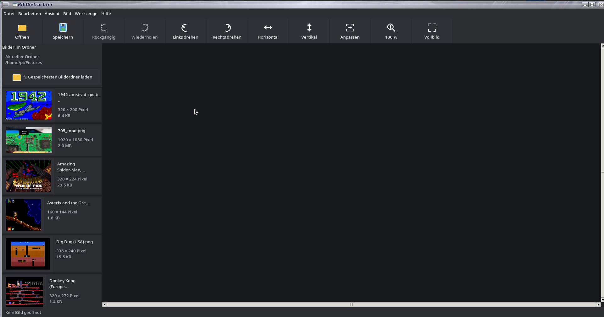

# Bildbetrachter v0.1.14

Ein kompakter Bildbetrachter und einfacher Bildeditor auf Basis von **Python, Tkinter und Pillow**.



## Highlights

- Moderne Symbolleiste mit Symbolen und Beschriftungen
- Öffnen und Speichern mit Datei-Symbolen
- Miniaturbilder des aktuellen Ordners
- Neben jeder Vorschau: **Dateiname, Bildabmessungen und Dateigröße**
- Klick auf ein Vorschaubild öffnet das Bild in der großen Hauptanzeige
- Optionales Fenster **Datei → Bildinformationen...**; erscheint nur auf ausdrücklichen Aufruf und kann geschlossen werden
- Gespeicherten Bildordner direkt als aktuellen Ordner laden
- Rückgängig / Wiederholen
- Zuschneiden und Größe ändern
- Drehen und Spiegeln
- Helligkeit, Kontrast und Sättigung
- Graustufen, Negativ und Schwarzweiß
- Schärfen und Weichzeichnen
- Zoom, 100 % und Fensteranpassung
- Vorheriges / nächstes Bild
- Diashow und Vollbild
- Drucken und Hintergrundbild setzen
- Deutsch / English
- Hell / Dunkel
- Frei wählbarer Bildordner
- Letzten verwendeten Ordner automatisch merken
- Änderungen werden beim Bildwechsel und beim Beenden erkannt; vor dem Verlassen kann das bearbeitete Bild gespeichert werden

## Unterstützte Formate

PNG, JPEG/JPG, BMP, GIF, WebP und TIFF

## Installation

### Windows

1. **Python installieren**
   - Lade Python 3 von der offiziellen Python-Webseite herunter.
   - Beim ersten Installationsfenster unbedingt **„Add python.exe to PATH“** aktivieren.
   - Danach die Python-Installation abschließen.

2. **Bildbetrachter herunterladen**
   - Lade die Datei `Bildbetrachter_v0.1.14_GITHUB_RELEASE.zip` aus dem GitHub-Release herunter.
   - Entpacke die ZIP-Datei vollständig, z. B. nach `Dokumente` oder auf den Desktop.
   - Beim Entpacken entsteht der Ordner `Bild`.

3. **Abhängigkeiten installieren**
   - Öffne im Ordner `Bild` ein Terminal bzw. eine Eingabeaufforderung.
   - Führe aus:

   `py -m pip install -r requirements.txt`

   Falls `py` nicht funktioniert, versuche:

   `python -m pip install -r requirements.txt`

4. **Programm starten**
   - Im gleichen Ordner ausführen:

   `py Bildbetrachter.py`

   Falls `py` nicht funktioniert:

   `python Bildbetrachter.py`

5. **Desktop-Verknüpfung**
   - Eine Windows-Desktop-Verknüpfung kann bei Bedarf manuell auf `Bildbetrachter.py` erstellt werden.
   - Als Programmaufruf kann der Python-Interpreter mit `Bildbetrachter.py` als Argument verwendet werden.

**Falls Windows meldet, dass Python nicht gefunden wurde:** Python erneut installieren und dabei **„Add python.exe to PATH“** aktivieren. Danach das Terminal neu öffnen.

### Linux

1. Die Release-ZIP herunterladen und entpacken.
2. Im Ordner `Bild` ein Terminal öffnen.
3. Abhängigkeiten installieren:

   `python3 -m pip install -r requirements.txt`

4. Programm starten:

   `python3 Bildbetrachter.py`

5. Optional kann die Desktop-Verknüpfung installiert werden:

   `chmod +x install_desktop_launcher.sh`

   anschließend:

   `./install_desktop_launcher.sh`

### PDF-Anleitung

Eine ausführliche Anleitung befindet sich ebenfalls im Ordner:

`Bildbetrachter_Anleitung_v0.1.14.pdf`

## Installation unter Windows

Python 3 installieren und anschließend in diesem Ordner ausführen:

```bat
py -m pip install -r requirements.txt
py Bildbetrachter.py
```

Alternativ kann `python` statt `py` verwendet werden, wenn Python entsprechend eingerichtet ist.

## Bildordner

Unter **Werkzeuge → Einstellungen → Bildordner** kann ein fester Bildordner ausgewählt werden.

Der Button **„📂 Gespeicherten Bildordner laden“** übernimmt diesen Ordner direkt als aktuellen Ordner im Programm. Der externe Dateimanager wird dabei nicht geöffnet.

Die Ordnerlogik verwendet:

1. den festgelegten Bildordner,
2. danach den zuletzt verwendeten Ordner,
3. danach den Programmordner `Bild`.

## Tastenkürzel

Die wichtigsten Kürzel werden direkt rechts neben den Menüeinträgen angezeigt.

- `Ctrl+O` – Öffnen
- `Ctrl+S` – Speichern
- `Ctrl+Shift+S` – Speichern unter
- `Ctrl+P` – Drucken
- `Ctrl+Z` / `Ctrl+Y` – Rückgängig / Wiederholen
- `Ctrl+Shift+X` – Zuschneiden
- `Ctrl+E` – Größe ändern
- `Ctrl+F` – An Fenster anpassen
- `Ctrl+0` – 100 %
- `+` / `-` – Zoom
- `F11` – Vollbild
- `Esc` – Vollbild verlassen bzw. geöffnetes Bildinformationsfenster schließen
- `Ctrl+L` / `Ctrl+R` – Links / rechts drehen
- `Ctrl+H` / `Ctrl+Shift+H` – Horizontal / vertikal spiegeln
- `Ctrl+G` / `Ctrl+I` / `Ctrl+B` – Graustufen / Negativ / Schwarzweiß
- `Ctrl+K` / `Ctrl+Shift+B` – Schärfen / Weichzeichnen
- `Ctrl+1` / `Ctrl+2` / `Ctrl+3` – Helligkeit / Kontrast / Sättigung
- `F5` – Diashow
- `←` / `→` – Vorheriges / nächstes Bild

## Einstellungen

Die zentralen Einstellungen liegen in `settings.ini` im Programmordner `Bild/`.

Gespeichert werden unter anderem Sprache, Theme, Fensterstatus, Zoom, Diashow-Intervall, Bildordner und zuletzt verwendeter Ordner.

## Anleitung

Die ausführliche PDF-Anleitung liegt bei:

`Bildbetrachter_Anleitung_v0.1.14.pdf`

Zusätzlich ist die Anleitung direkt über **Hilfe → Anleitung** im Programm erreichbar.

## Version

**Bildbetrachter v0.1.14**  
**By Goldisoft 2026**

## v0.1.14 – weitere Verbesserung

- Toolbar-Symbole sind im hellen Modus jetzt gut sichtbar und passen sich beim Theme-Wechsel automatisch an.

## Unterstützte Bildformate in v0.1.14

Öffnen: BMP/DIB, JPEG (JPG/JPEG/JPE/JFIF), PNG, GIF, WebP, TIFF, ICO, PPM, PGM, PBM, PNM, XBM, XPM, TGA und PCX.

Die genannten Formate basieren auf den direkt von Pillow bereitgestellten Standardformaten; Formate mit zusätzlichen externen Codec-Abhängigkeiten werden bewusst nicht vorausgesetzt.
